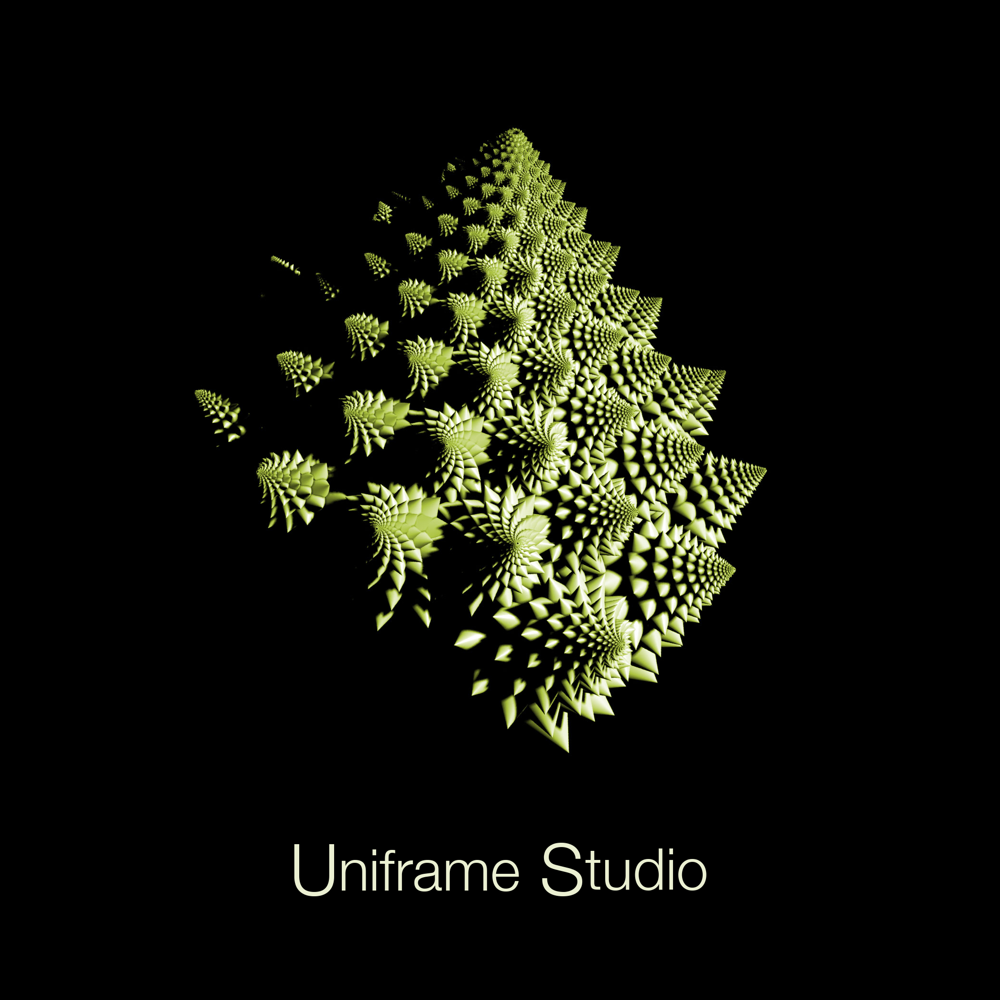

<p align="center">
  
</p>

<h1 align="center" style="color:#ebf0d2; font-family: monospace;">Uniframe Studio</h1>
<p align="center" style="color:#aaaaaa;">
  An AI-powered dubbing system — transcribe, translate, synthesize, align.
</p>

<p align="center">
  
  
  
  
</p>


## Overview

**Uniframe Studio** is an intelligent dubbing system designed to automate the process of video translation and voiceover with high temporal precision. It synthesizes a new audio track using TTS models and precisely aligns the original video to match the timing of the new voiceover.

---

## 🎬 Demo

_Coming soon..._

---

## 🔄 Workflow

### Audio Pipeline

1. **Extract audio** from video.
2. **Transcribe** with both segment-level and word-level timestamps to support the system’s meaning-aware translation process.
3. **Transcript correction** (prepare transcription segments for translation).
4. **Translate** each corrected segment into the target language.
5. **Voiceover** generation using TTS:
   - ElevenLabs (including original voice cloning)
   - OpenAI (multiple voice options)
6. **Audio synthesis**: Build the final audio track (mono and stereo versions).

### Video Alignment

1. **Split original video into segments** using transcript timestamp data.
2. **Stretch/compress video segments** to match new voiceover segment durations.
3. **Merge adjusted segments** into a final video synced with the new audio track.

---

## Features

- Full CLI control (all steps available to use separately via `cli.py` commands).
- Accurate transcription and it's structure correction.
- Multi-language support via high-quality translation.
- Voiceover with choice of synthetic voices.
- Auto-assembled audio tracks (mono/stereo).
- Frame-accurate video reassembly aligned with new speech duration.

---

## CLI Usage

All commands are available to use separately in the `cli.py` interface. Each command is described in detail in `DEV_NOTES.md`, including args, expected inputs and outputs.

## 🚀 Example of the full pipeline:

❗️Before running the pipeline, you may want to check out available processing options such as voice selection, intro/outro addition, and other advanced features.
Refer to DEV_NOTES.md for details.

🔧 Don't forget to provide you API-keys for transcription, translation and TTS services - Eleven Labs (with ELEVEN_LABS_VOICE_ID) or OpenAI, depending on who's API you are going to use.

🔧 Make sure you have **ffmpeg** installed at the system level.

**1. Processing pipeline | Stage 1:** 

- Place the source video file in the ./video_input folder.
- Run the first stage of the processing pipeline with the following command:

```bash
python processing_pipeline_stage1.py --input video_input/input.mp4
```

- As a result of Stage 1, you’ll get a file named input_transcribed_corrected_cleaned_optimized_adjusted.json in the ./output/timestamped_transcriptions folder.
- You can verify that the transcription is accurate by comparing some segment timestamps with the source video. 
- If everything looks good, proceed to Stage 2 of the pipeline.

**2. Processing pipeline | Stage 2:**

```bash
python processing_pipeline_stage2.py --input output/timestamped_transcriptions/input_transcribed_corrected_cleaned_optimized_adjusted.json
```

- As a result of Stage 2, you’ll get two versions (mono and stereo) of the new audio track in the ./output/audio_result folder.

**3. Processing pipeline | Stage 3:**

_Coming soon..._

---

## 🤝 Contributing

Contributions are welcome! Please feel free to submit a Pull Request. 🤗

---

## ⚖️ License

This project is licensed under the Apache 2.0 License.
